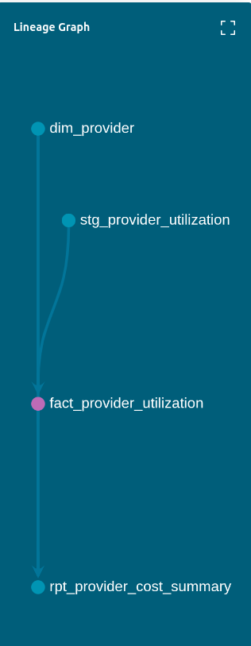

# Healthcare Claims Analytics Pipeline

A production-style data pipeline built on Snowflake and dbt using real CMS Medicare data. I built this to demonstrate the kind of platform engineering work I do day-to-day — standing up a medallion architecture from raw government data through a clean, tested, reporting-ready data model.

---

## What It Does

Ingests the CMS Medicare Physician & Other Practitioners dataset (2024, ~1.3M provider records) and transforms it through three layers:

- **Bronze** — raw data landed exactly as received, nothing changed except an audit timestamp
- **Silver** — typed, cleaned, and decoded into purpose-built views (providers, utilization, beneficiary demographics)
- **Gold** — star schema tables ready for BI tools: a provider dimension, a utilization fact, and a reporting aggregate that crosses cost with chronic condition burden

The reporting layer makes it possible to answer questions like: which provider specialties have the highest drug cost share? Which states have the highest average beneficiary risk scores? How does diabetes prevalence vary across provider types?

---

## Tech Stack

| Layer | Tool |
|---|---|
| Cloud warehouse | Snowflake (AWS us-east-2) |
| Transformation | dbt Core 1.11 + dbt-snowflake |
| Data source | CMS Medicare Physician & Other Practitioners 2024 |
| Language | SQL (Snowflake dialect + Jinja via dbt) |

---

## Data Model

```
HEALTHCARE_CLAIMS
├── BRONZE
│   └── brz_provider_claims          (1.3M rows — raw passthrough + audit ts)
│
├── SILVER
│   ├── stg_providers                (provider identity, location, specialty)
│   ├── stg_provider_utilization     (financial totals, drug vs non-drug split)
│   └── stg_provider_beneficiaries   (demographics, chronic condition rates)
│
└── GOLD
    ├── dim_provider                 (MD5 surrogate key, all provider attributes)
    ├── fact_provider_utilization    (cost facts + payment/charge ratio)
    └── rpt_provider_cost_summary    (aggregate by state × specialty × entity type)
```



### Design decisions worth calling out

- All columns are loaded as `VARCHAR` in the raw table — type casting happens in silver, not at load time. This means a bad batch never corrupts the raw layer.
- Silver models are views, gold models are tables. Silver is cheap to rebuild; gold is queried by BI tools and needs materialized performance.
- Surrogate keys on all dimensions use `dbt_utils.generate_surrogate_key` so join keys are stable even if the source data is reloaded.
- `fact_provider_utilization` is clustered on `state_code` and `provider_type` — the two most common filter dimensions in the reporting layer.
- CMS suppresses counts below 11 to protect beneficiary privacy. The `drug_suppression_flag` and `med_suppression_flag` columns surface this rather than silently dropping it.
- `DBT_USER` runs with a dedicated role (`DBT_ROLE`) scoped to the minimum permissions it needs. Admin credentials are only used for initial data loading.

---

## Data Tests

21 dbt tests covering not-null and uniqueness constraints across all layers. All pass.

```
Done. PASS=21 WARN=0 ERROR=0 TOTAL=21
```

---

## Source Data

[CMS Medicare Physician & Other Practitioners — by Provider (2024)](https://data.cms.gov/provider-summary-by-type-of-service/medicare-physician-other-practitioners/medicare-physician-other-practitioners-by-provider)

One row per rendering NPI. Includes utilization totals, drug vs non-drug splits, beneficiary demographics, and chronic condition prevalence rates for 22 conditions across ~1.3M providers.
